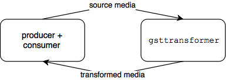
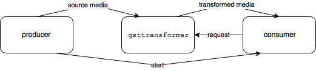
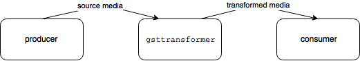
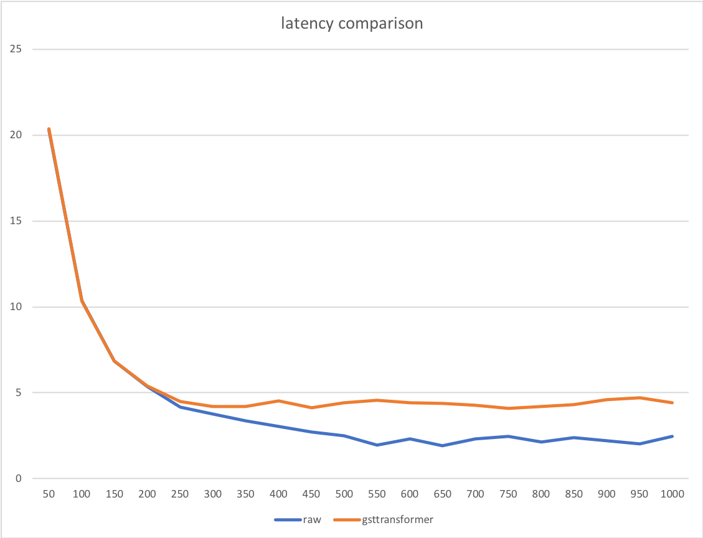

# gsttransformer

A library and gRPC based service for running gstreamer based media transformation as a service.

Since gRPC clients can be generated in many programming lagnuages and platforms, the service is completely agnostic to the clients.

## Features

* #### Embeddable library, in-proc, Unix domain or TCP gRPC API

You can use `gsttransformer` has a simple library, as an in-proc gRPC in the same process, as a service over different process Unix socket, or as a service over remote TCP connections. All using simple and platform supported gRPC.

* #### Flexible media processing pipelines

Using `gst-launch` declarative media pipelines, you can either preset your pipelines or even specify them on per-call basis.

* #### Highly scalable async RPC

Built using async gRPC framework that makes it very scalable when handling multiple requests.

* #### Stream sanitization and format enforcement

GStreamer is a very stable and powerful media processing framework. You have all the freedom to construct your pipelines in such a way to enforce formats, do sanitation and much more.

* #### Processing flow control, duration, rate control and stream QoS

It is often the case that you want to enforce certain characteristics on how you process your media. For example, you want your pipeline to process at maximum of 1.0 Real Time speech. This allows you to manage maximum resource consumption.

`gsttransformer` allows you to control the processing rate in media time (not input bytes), and gives you the option to enforce it using blocking-based flow control or simply erroring.

## Modes of operation

Depending on your service setup, you can run `gsttransformer` in three modes. In all modes, flow control is maintained from consumer to producer.

* #### Media source and consumer are the same:



Simplest setup. Same RPC call to stream source media, then receive a stream of transformed media.

* #### Media source different from producer - pull



In this mode, source (producer) makes a call to initiate the stream, gets a request ID, then makes a call to the consumer to inform it with the request ID. Consumer then makes a call to `gsttransformer` and waits for the transformed media. Finally, the producer starts streaming.

Note that producer does not need to wait for consumer to start the call.

* #### Media source different from producer - push/chanined



In this mode, producer makes a call to `gsttransformer` to initiate the transformation in addition to consumer endpoint. Then, `gsttransformer` makes a streaming call to the consumer endpoint. Finally, producer can start streaming media.

Note that this mode requires the consumer to implement RPC protocol to recieve the chained call.

## How to use

`gsttransformer` can be used in different ways:

#### As a service ([`gst-transformer.cpp`](https://github.com/technicianted/gsttransformer/blob/master/src/server/gst-transformer.cpp))

1. Unix domain socket:
```bash
./gsttransformerserver -c config.json unix:///var/run/gsttransformer.sock
```

Docker:
```bash
docker run --rm -it \
    -v /path/to/config/:/config \
    -v /var/run/:/var/run \
    -e GSTTRANSFORMER_CONFIG_PATH=/config/server.json \
    -e GSTTRANSFORMER_ENDPOINT=unix:///var/run/gsttransformer.sock \
    technicianted/gsttransformer:experimental
```

2. TCP/IP socket:
```bash
./gsttransformerserver -c config.json 0.0.0.0:8080
```
Docker:
```bash
docker run --rm -it \
    -v /path/to/config/:/config \
    -e GSTTRANSFORMER_CONFIG_PATH=/config/server.json \
    -e GSTTRANSFORMER_ENDPOINT=0.0.0.0:8080 \
    -p 8080:8080 technicianted/gsttransformer:experimental
```

Client:
1. Example C++ ([`gst-transformer-client.cpp`](https://github.com/technicianted/gsttransformer/blob/master/src/samples/gst-transformer-client.cpp))
```bash
# convert input video to ogg/theora at 1fps at maximum 5xrealtime rate
# connect to service at unix domain socket /var/run/gsttransformer.sock
./gsttransformerclient \
    -r 5.0
    -p video/ogg_theora_256k_1fp \
    -i la_chute_d_une_plume_576p.ogv \
    -o output.ogv \
    unix:///var/run/gsttransformer.sock
```

#### As an in-proc gRPC for your app process ([`gst-transformer-inproc.cpp`](https://github.com/technicianted/gsttransformer/blob/master/src/samples/gst-transformer-inproc.cpp))
```bash
# convert input video to ogg/theora at 1fps at maximum 5xrealtime rate
# connect to in-proc service
./gsttransformerinproc \
    -s "decodebin ! videorate ! video/x-raw,framerate=1/1 ! timeoverlay halignment=right valignment=top ! clockoverlay halignment=left valignment=top ! theoraenc bitrate=256 ! oggmux" \
    -i la_chute_d_une_plume_576p.ogv \
    -o output.ogv
```

#### As an embedded shared library for your app process (C++ only)

In this mode, you simply link and use `gsttransformer.so` and use `DynamicPipeline` directly.

#### Sample service configurations [`sampleconfig.json`]():
```json
{
    "limits": {
        "allowDynamicPipelines":true,
        "rate":{
            "description":"clients are request any processing rate",
            "max":-1
        },
        "lengthLimitMillis":{
            "description":"clients can process media of any length",
            "max":0
        },
        "startToleranceBytes":{
            "description":"pipeline must start before consuming first 10000 bytes",
            "max":10000
        },
        "readTimeoutMillis":{
            "description":"clients can specify read timeout of maximum 5 seconds",
            "max":5000
        },
        "pipelineOutputBuffer":{
            "description":"clients can request output buffering of up to 1MB",
            "max":1000000
        }
    },

    "pipelines": [
        {
            "id":"ogg_vorbis/pcm_16le_16khz_mono",
            "specs":"oggdemux ! vorbisdec ! audioconvert ! audioresample ! audio/x-raw,format=S16LE,channels=1,rate=16000",
            "description":"ogg/vorbis audio input to pcm16khz16le"
        },
        {
            "id":"flac/ogg_vorbis",
            "specs":"flacdec ! audioconvert ! vorbisenc ! oggmux",
            "description":"encode flac audio to ogg/vorbis"
        },
        {
            "id":"audio/pcm_16le_16khz_mono",
            "specs":"decodebin ! audioconvert ! audioresample ! audio/x-raw,format=S16LE,channels=1,rate=16000",
            "description":"normalize any audio to pcm16khz16le"
        },
        {
            "id":"video/ogg_theora_256k_1fp",
            "specs":"decodebin ! videorate ! video/x-raw,framerate=1/1 ! timeoverlay halignment=right valignment=top ! clockoverlay halignment=left valignment=top ! theoraenc bitrate=256 ! oggmux",
            "description":"normalize any video to 1fps with time, duration to ogg/theora"
        }
    ]
}
```

## Why would you need it (as a service)

If you have a service that relies or works with media, then you would face at least one of the two challenges:

#### 1. Variability and variety of media formats and codecs

Handling media processing is often challenging due to the amount of different formats, codecs and other nuiances such as timing, rate, etc. In addition, if you are an externally exposed service, you will have to deal with bad formats and misbehaving clients.

This framework provides a standalone way of deligating all this work to an separate service. All you have to do is manage the interfacing.

#### 2. Scalability

Although you can link agains `gsttransformer` library directly to embed in your apps, this creates a stong coupling between scalability of media handling and the scalability of your core service.

This is often undesirable: Typically you want service components handling different aspects to be scaled independently, especially if their resource requirements are different.

#### 3. Isolation of resources

Media handling usually involves intensive CPU and potentially memory. If your service heavily relies on media processing, then you will want to run it in isolation to be able to control its resources without affecting the main service.

## Performance considerations

`gsttansformer` adds an RPC layer on top of `gstreamer` pipelines. Eventhough gRPC is quite fast, there are some considerations when evaluating `gsttransformer`.

In order to better evaluate the effects, consider the comparison between _raw_ pipeline performance using `gst-launch` and file `source` and `sink`, versus `gsstramer` using Unix socket, reading and writing from and to local files.

With this setup, let's take a look at how performance is affected:

#### 1. Pipeline execution time per media frame

Depending on the elements in the pipeline and how long it takes them to process media, the overall latency is affected: The higher algorithm latency incurred by the elements, the lower the contribution of `gsttransformer` to the end to end latency.

For example, consider the following two pipelines:

* High computation video processing pipeline:

Decode input video, overlay tiem and clock, then encode in theora in ogg container:
```
decodebin ! videorate ! video/x-raw,framerate=1/1 ! timeoverlay halignment=right valignment=top ! clockoverlay halignment=left valignment=top ! theoraenc bitrate=256 ! oggmux
```

* Low computation audio processing pipeline:

Decode input audio into raw PCM, single channel at 16kHz:
```
decodebin ! audioconvert ! audioresample ! audio/x-raw,format=S16LE,channels=1,rate=16000
```

We run both pipelines at maximum possible rate:

|Type|Raw|`gsttransformer`|Overhead|
|-|-|-|-|
|Video: 10min, 45MB AVC/Vorbis|35.8s|36.3s|-1.4%|
|Audio: 17min, 4.19MB Ogg/Vorbis|1.1s|2.3s|-43%|

_Note that in practice, you probably will not want your pipeline to run with unlimited rate. Instead, to gain better performance in scale, you would typically decrease the rate._

#### 2. Pipeline stream processing rate

The second implication is how fast you process input media. The following chart shows media transformation time in seconds for `gst-launch` (raw) vs `gsttransformer` when run with various media processing rates in xRT. 

To emphasize the contribution of the rate, the pipeline is the same audio pipeline as above with 17 minutes audio.



As you can see, the gap starts at around 250xRT. Also notice that `gsttransformer` latency plateaus at the point where the overhead of RPC for input/output messages exceeds the processing time of an input message.

Again, to emphasize the point, when running media transofrmation at scale, it is better not to run at maximum rate. Otherwise resource utilization patterns will not be predictable. In addition, sudden spikes to requests will correspond to sudden sharp increase in resources, which makes autoscaling challenging.

#### 3. Size of RPC send and RPC receive

The final contributing factor to performance is how many RPC messages are sent and recieved. In addition to network stack overhead, with each message, gRPC performs serialization and unserialization. The effect of messages naturally increases as the time the pipelines takes to process a message decreases.

You can enable server-side buffering of transformed media messages by byte size. This can help you control the number of response messages sent.

## Some use-cases

* #### Media processing as a service

* #### Media normalization as a service

* #### Audio and video processing adaptors/side-cars
